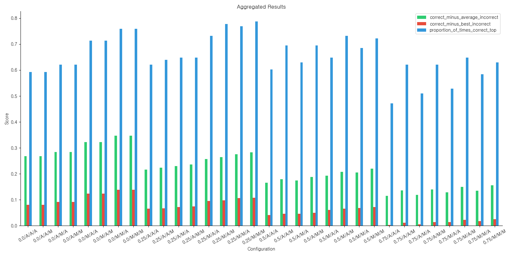
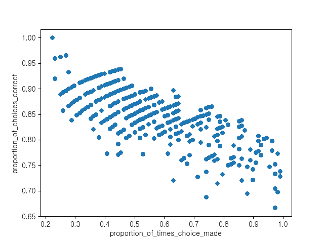

# Headword Finder

## Goal

The goal of this project is to create a tool for finding which of a set of headwords is being used in a specific usage instance for my Korean dictionary.

Users need to be able to input text and have words used in that text automatically derived and added to the correct dictionary entries. This requires finding a list of the
dictionary words (lemmas) in the text and which of the meanings of the word (headword) is specifically being used in the text.

Headwords are made up of multiple senses. For example, [Wikipedia](https://en.wikipedia.org/wiki/Lemma_(morphology)#Headword) uses the headword 'bread' with senses for the 
food 'bread' and another for money 'bread'. Because these senses fundamentally describe the same thing (one is just idiomatic), they are under the same headword.

This is similar to [word-sense disambiguation](https://en.wikipedia.org/wiki/Word-sense_disambiguation) but for my purposes I only need to find which headword is being used, 
which makes things easier.

## Process

### Korean Data

The model is trivially able to pick out which headword is used when one far exceeds all others in frequency, as just picking the most common headword will yield high accuracy rates. As a result, I purposely picked mostly words that have more than one common meaning to find the model that performs best facing harder problems.

Words used include 눈 \[eye / snow\], 못 \[can't / pond / nail\], and 밤 \[chestnut / night\], but most were two syllable Sino Korean words.

The data I have access to is from [Urimalsaem 우리말샘](https://opendict.korean.go.kr/main), which contains over one million headwords.
For each of these headwords, I have a list of definitions paired with any number of example sentences for that headword.

### Scoring Headwords

To find the likelihood that the example sentence matches the definition or any example sentence, I compare the [KoBERT](https://github.com/SKTBrain/KoBERT) embeddings for
the sentences. Example sentences compare the embeddings for the specific lemma being tested, while the definitions compare the overall embedding of the sentence since the
definition does not contain the word (if it's a good definition).

Multiple parameters needed to be tested to find a suitable model for my use case. These include:
- The weighted importances of definition similarity vs. example usage similarity
- How to "score" the similarity of a headword given all of the scores of its senses, each with a definition and list of example usages
- When to confidently return a specific headword vs. return nothing

Consider an example with the English word 'pen', with two headwords:

Headword 1
- Sense 1: A tool, originally made from a feather but now usually a small tubular instrument, containing ink used to write or make marks.
  - Example 1: He took notes with a {pen}.
- Sense 2: A writer, or their style.
  - Example 1: He has a sharp {pen}.
- Sense 3: Marks of ink left by a pen.
  - Example 1: He's unhappy because he got {pen} on his new shirt.   

Headword 2
- Sense 1: An enclosure (enclosed area) used to contain domesticated animals, especially sheep or cattle.
  - Example 1: There are two steers in the third {pen}.
- Sense 2: A penitentiary, i.e. a state or federal prison for convicted felons.
  - Example 1: They caught him with a stolen horse, and he wound up in the {pen} again. 

Here is an example output from running the model on a sentence I wrote with the word 'pen':
```
$ python run_single_test.py english inputs/eng/pen.json 0.2 average max max 
======================================================================
Unknown usage: After putting the cows back into their pen, the farmer worked on repairing the part of the fence they had broken through. | source: me
0.61609 | An enclosure (enclosed area) used to contain domesticated animals, especially sheep or cattle.
0.49334 | A tool, originally made from a feather but now usually a small tubular instrument, containing ink used to write or make marks.

Correct - avg incorrect is 0.12275516986846924
Chosen index (min acceptance 0.5, min delta 0.05) is 1
======================================================================
```
The argument `0.2` is the weight of sense definitions (so `0.8` is the weight of sense example usages).
The next three arguments are for turning lists of similarities into single scores.
The first `average` means that the score of a list of sense example usages is their average.
The second `max` means that the best set of example usages is used for each headword.
The third `max` means that the best definition is used for each headword.

In this case, the headword for an animal pen was over the `min acceptance` score (0.61 > 0.5) and the difference between it and second place was at least `min delta` (0.12 > 0.05), so it is confident that that headword is the correct one.


## Results



In this graph, the x axis shows the specific configuration with regards to the weight of sense definitions and the three arguments for turning lists of scores for headwords' examples and definitions into a single score.

As shown,
- all configurations in which the example usage similarities are averaged for a sense perform consistently worse.
- weighting the definitions very low (at 0%) increases the average margin at which the correct headword is chosen, but also decreases the accuracy of picking the correct headword.
- averaging both the sets of example usages and the sets of definitions performs worse than maxing at least one of them.



This is a plot I created after running the tests from the picture above. Each point is a specific configuration combined with a specific `min_acceptance` and `min_delta` value.

For each point, the return rate (x axis) and proportion of returns that returned the correct headword (y axis) is returned. There is a negative correlation between the two, expected since higher return rates are the result of being less cautious with when something is returned.

Since the goal is to return as often as possible without being wrong too often, I chose a point in the graph that is a good median between returning a headword often enough to be useful and with enough accuracy. It is for the configuration `0.2/M/M/A/0.3/0.1`, meaning:
- definitions have a weight of 0.2,
- the best example sentence is taken from a sense's examples,
- the best set of example sentences is used for a headword,
- the definitions for a headword are averaged,
- a headword must have at least a score of 0.3 to be returned, and
- the delta between the first and second place headword must be at least 0.1 for the first to be returned.

This has a return rate of 45.4% and an accuracy of 93.9% (**for these intentionally ambiguous examples**).

For the average lemma, it is a good policy since it is heavily biased toward headword with example sentences. This means that it will for those cases almost always pick the common headword if only one is common.


